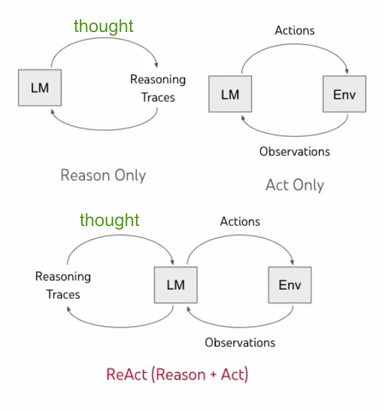

# ReAct

[ReAct Prompting](https://www.promptingguide.ai/techniques/react)와 같이 ReAct는 reasoning traces와 task-specific actions을 교차 배열하는 방식(interleaved manner)으로 동작합니다. 

## 동작 방식

[ReAct: Synergizing Reasoning and Acting in Language Models](https://arxiv.org/abs/2210.03629)에서는 LLM에게 단계별로 추론 흔적(reseoning traces)과 작업별 조치들(task-specific actions)을 생성하도록 요청하면 작업 수행 능력이 향상된다(the use of LLMs to generate both reasoning traces and task-specific actions in an interleaved manner) 라고 설명하고 있습니다.

아래와 같이 [LangChain의 ReAct는 Reasoning와 Action](https://www.youtube.com/watch?v=Eug2clsLtFs)으로 표현됩니다. 여기서는 생각하는 방법(Paradigm of thinking)으로 Reseoning은 답변의 정당성(justification of the answer)을 확인하여, 답변에 필요한 것(prime)을 찾습니다. 또한, 현재의 환경(Envrionment)에서 어떤 행동(Action)을 선택(SayCan)하고, 관찰(Obseravation)을 통해 결과를 확인합니다.  




동작 방식을 이해하기 위하여 [YT_LangChain_Agents.ipynb](https://github.com/samwit/langchain-tutorials/blob/main/agents/YT_LangChain_Agents.ipynb)와 같이 agent를 실행합니다.

```text
agent.run("Who is the United States President? What is his current age raised divided by 2?")
```

이때의 실행 결과는 아래와 같습니다.

```text
> Entering new AgentExecutor chain...
 I need to find out who the President is and then do some math.
Action: Search
Action Input: "United States President"
Observation: Joe Biden
Thought: I now need to find out Joe Biden's age.
Action: Search
Action Input: "Joe Biden age"
Observation: 80 years
Thought: I now need to divide Joe Biden's age by 2.
Action: Calculator
Action Input: 80/2
Observation: Answer: 40
Thought: I now know the final answer.
Final Answer: Joe Biden is the United States President and his current age raised divided by 2 is 40.
```

### ReAct의 구현

[Reasoning and Action의 약자](https://blog.kubwa.co.kr/%EB%85%BC%EB%AC%B8%EB%A6%AC%EB%B7%B0-%EB%9E%AD%EC%B2%B4%EC%9D%B8%EA%B4%80%EB%A0%A8-%EB%85%BC%EB%AC%B8-react-synergizing-reasoning-and-acting-in-language-models-%EA%B0%84%EB%8B%A8%ED%95%9C-%EC%8B%A4%EC%8A%B5-w-pytorch-dd31321ead00)로서, reasoning trace는 CoT(Chain of Thought)을 기초로 하고, Reasoning과 action을 반복적으로 수행하면서 환각(Hallucination)과 에러 전파(error properation)을 줄일 수 있습니다. 이를 통해 사람처럼 task를 푸는 것(human like task solving trajectory)을 가능하게 합니다.

이때, ReAct를 위한 Prompt는 [hwchase17/react](https://smith.langchain.com/hub/hwchase17/react)을 참조해 아래와 같이 정의합니다. 불필요한 반복을 막기 위하여 Thought을 추가하였습니다. 

```python
PromptTemplate.from_template("""Answer the following questions as best you can. You have access to the following tools:

{tools}

Use the following format:

Question: the input question you must answer
Thought: you should always think about what to do
Action: the action to take, should be one of [{tool_names}]
Action Input: the input to the action
Observation: the result of the action
... (this Thought/Action/Action Input/Observation can repeat N times)
Thought: I now know the final answer
Final Answer: the final answer to the original input question

When you have a response to say to the Human, or if you do not need to use a tool, you MUST use the format:
'''
Thought: Do I need to use a tool? No
Final Answer: [your response here]
'''

Begin!

Question: {input}
Thought:{agent_scratchpad}
""")
```

이를 부분적으로 한글화한 Prompt는 아래와 같습니다. 상세한 코드는 [lambda-chat](./lambda-chat-ws/lambda_function.py)을 참조합니다.

```python
PromptTemplate.from_template("""다음은 Human과 Assistant의 친근한 대화입니다. Assistant은 상황에 맞는 구체적인 세부 정보를 충분히 제공합니다. Assistant의 이름은 서연이고, 모르는 질문을 받으면 솔직히 모른다고 말합니다.

사용할 수 있는 tools은 아래와 같습니다:

{tools}

다음의 format을 사용하세요.:

Question: 답변하여야 할 input question 
Thought: you should always think about what to do. 
Action: 해야 할 action로서 [{tool_names}]중 하나를 선택합니다.
Action Input: action의 input
Observation: action의 result
... (Thought/Action/Action Input/Observation을 3번 반복 할 수 있습니다.)
Thought: 나는 이제 Final Answer를 알고 있습니다. 
Final Answer: original input에 대한 Final Answer

너는 Human에게 해줄 응답이 있거나, Tool을 사용하지 않아도 되는 경우에, 다음 format을 사용하세요.:
'''
Thought: Tool을 사용해야 하나요? No
Final Answer: [your response here]
'''

Begin!

Question: {input}
Thought:{agent_scratchpad}
""")
```

ReAct Prompt를 이용해 실제 구현은 아래와 같습니다. 여기서는 LangChain의 Prebuilt component인 [create_react_agent](https://langchain-ai.github.io/langgraph/reference/prebuilt/)을 이용합니다.

```python
def run_agent_react(connectionId, requestId, chat, query):
     # create agent
    isTyping(connectionId, requestId)
    agent = create_react_agent(chat, tools, prompt_template)
    
    agent_executor = AgentExecutor(
        agent=agent, 
        tools=tools, 
        verbose=True, 
        handle_parsing_errors=True,
        max_iterations = 5
    )
    
    # run agent
    response = agent_executor.invoke({"input": query})

    # streaming    
    msg = readStreamMsg(connectionId, requestId, response['output'])

    msg = response['output']
            
    return msg
```

### ReAct Chat의 구현

[react-chat](https://smith.langchain.com/hub/hwchase17/react-chat)을 이용하여 채팅이력이 포함된 ReAct Agent를 정의할 수 있습니다.

```python
def get_react_chat_prompt_template():
    return PromptTemplate.from_template("""Assistant is designed to be able to assist with a wide range of tasks, from answering simple questions to providing in-depth explanations and discussions on a wide range of topics. As a language model, Assistant is able to generate human-like text based on the input it receives, allowing it to engage in natural-sounding conversations and provide responses that are coherent and relevant to the topic at hand.

Assistant is constantly learning and improving, and its capabilities are constantly evolving. It is able to process and understand large amounts of text, and can use this knowledge to provide accurate and informative responses to a wide range of questions. Additionally, Assistant is able to generate its own text based on the input it receives, allowing it to engage in discussions and provide explanations and descriptions on a wide range of topics.

Overall, Assistant is a powerful tool that can help with a wide range of tasks and provide valuable insights and information on a wide range of topics. Whether you need help with a specific question or just want to have a conversation about a particular topic, Assistant is here to assist.

TOOLS:
------

Assistant has access to the following tools:

{tools}

To use a tool, please use the following format:

Thought: Do I need to use a tool? Yes
Action: the action to take, should be one of [{tool_names}]
Action Input: the input to the action
Observation: the result of the action

When you have a response to say to the Human, or if you do not need to use a tool, you MUST use the format:

Thought: Do I need to use a tool? No
Final Answer: [your response here]

Begin!

Previous conversation history:
{chat_history}

New input: {input}
{agent_scratchpad}"""
```

이를 한글화한 Prompt는 아래와 같습니다. 상세한 코드는 [lambda-chat](./lambda-chat-ws/lambda_function.py)을 참조합니다.

```python
def get_react_chat_prompt_template():
    return PromptTemplate.from_template("""다음은 Human과 Assistant의 친근한 대화입니다. Assistant은 상황에 맞는 구체적인 세부 정보를 충분히 제공합니다. Assistant의 이름은 서연이고, 모르는 질문을 받으면 솔직히 모른다고 말합니다.

사용할 수 있는 tools은 아래와 같습니다:

{tools}

Use the following format:

Question: 답변하여야 할 input question 
Thought: you should always think about what to do. 
Action: 해야 할 action으로서 [{tool_names}]중 하나를 선택합니다.
Action Input: action의 input
Observation: action의 result
... (Thought/Action/Action Input/Observation을 3번 반복 할 수 있습니다. 반복이 끝날때까지 정답을 찾지 못하면 마지막 result로 답변합니다.)
... (반복이 끝날때까지 적절한 답변을 얻지 못하면, 마지막 결과를 Final Answer를 전달합니다. )
Thought: 나는 이제 Final Answer를 알고 있습니다. 
Final Answer: original input에 대한 Final Answer

When you have a response to say to the Human, or if you do not need to use a tool, you MUST use the format:
'''
Thought: Do I need to use a tool? No
Final Answer: [your response here]
'''

Begin!

Previous conversation history:
{chat_history}

New input: {input}
Thought:{agent_scratchpad}
""")
    
def run_agent_react_chat(connectionId, requestId, chat, query):
    # get template based on react 
    prompt_template = get_react_chat_prompt_template()
    print('prompt_template: ', prompt_template)
    
    # create agent
    isTyping(connectionId, requestId)
    agent = create_react_agent(chat, tools, prompt_template)
    
    agent_executor = AgentExecutor(agent=agent, tools=tools, verbose=True, handle_parsing_errors=True)
    
    history = memory_chain.load_memory_variables({})["chat_history"]
    
    # run agent
    response = agent_executor.invoke({
        "input": query,
        "chat_history": history
    })
    
    # streaming
    msg = readStreamMsg(connectionId, requestId, response['output'])

    msg = response['output']
            
    return msg
```

